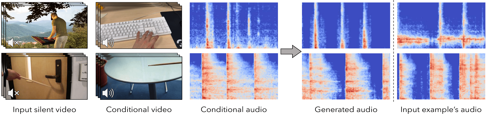

# Conditional Generation of Audio from Video via Foley Analogies

<h4>
Yuexi Du, Ziyang Chen, Justin Salamon, Bryan Russell, Andrew Owens
</br>
<span style="font-size: 14pt; color: #555555">
University of Michigan, Yale University, Adobe Research
</span>
</h4>

This is the official PyTorch implementation of "Conditional Generation of Audio from Video via Foley Analogies".
[[Project Page](https://xypb.github.io/CondFoleyGen/)] [[Arxiv](https://arxiv.org/abs/2304.08490)] [[Video](https://youtu.be/SEBf_Km8h_Q)]

<div align="center">
  
</div>

## Environment

To setup the environment, please run
```bash
conda env create -f conda_env.yml
conda activate condfoley
```

To setup SparseSync re-ranking environment, please run
```bash
cd SparseSync
conda env create -f conda_env.yml
conda activate sparse_sync
```

## Demo

A quick demonstrate to generate 6-sec audio with our model is to simply run
```bash
mkdir logs
python audio_generation.py --gh_demo --model_name 2022-05-03T11-33-05_greatesthit_transformer_with_vNet_randshift_2s_GH_vqgan_no_earlystop --target_log_dir demo_output --W_scale 3
```
The generated video will located at `logs/demo_output/2sec_full_generated_video_0`.

You may check the `audio_generation.py` to change the input videos and play with different videos of your own!

## Datasets

### Greatest Hits

We use the Greatestest Hits dataset to train and evaluate our model both qualitatively and quantitatively. Data can be downloaded from [here](https://andrewowens.com/vis/).

### Countix-AV

We use the Countix-AV dataset to demonstrate our method on a more realistic scenario. Data can be downloaded following the configs from [RepetitionCounting](https://github.com/xiaobai1217/RepetitionCounting) repo.

### Data Pre-processing

As described in the paper, we resampled the videos into 15FPS and resampled the audio into 22050Hz. The video is also resized to `(640, 360)` for faster loading. The audio is denoised with [noisereduce](https://github.com/timsainb/noisereduce) package.

FOr training preprocess, please use `feature_extraction\video_preprocess.py`, which will build correct training data structure. See the file for more detail. We have also updated the script so that you can use `--greatesthit` flag to process data for the Greatest Hits dataset and ignore this flag for the CountixAV dataset. **Note that there is no need for further denoise for the Greatest Hits dataset**.

For evaluation & demonstration purpose, please use `video_preprocess.py`.

### Data structure

#### Greatest Hits

The Greatest Hits dataset should be placed under the `data/` folder following such structure:
```
path/to/CondFoleyGen/
    data/
        greatesthit/
            greatesthit-process-resized/
                {video_idx}/
                    audio/
                        {videoIdx}_denoised.wav
                        {videoIdx}_denoised_resampled.wav
                    frames/
                        frame000001.jpg
                        frame000002.jpg
                        ...
                    hit_record.json
                    meta.json
                ...
```
The `meta.json` and `hit_record.json` files can be found at `data/greatest_hit_meta_info.tar.gz`, which contains all the necessary information in the correct structure. In fact, you may only use them when you train the GreatestHit model with spectrograms, which is deprecated. The current training scheme only uses the `.wav` audio file.

#### Countix-AV
Similarly, the Countix-AV dataset should be placed under the `data/` folder following such structure:
```
path/to/CondFoleyGen/
    data/
        ImpactSet/
            impactset-proccess-resize/
                {video_idx}/
                    audio/
                        {videoIdx}.wav
                        {videoIdx}_resampled.wav
                        {videoIdx}_resampled_denoised.wav
                    frames/
                        frame000001.jpg
                        frame000002.jpg
                        ...
                ...
```

### Train/Validation/Test split

We split each dataset on video level randomly. The split file is under the `data/` folder, named as `data/greatesthit_[train/val/test].json` and `data/countixAV_[train/val/test].json`

### Quantitative Evaluation on Greatest Hits

To conduct a fair evaluation on the Greatest Hit dataset, we build a fixed test set composed of 2-sec. conditional and target video pairs cropped from previous test split following the description in the paper. Please check `data/AMT_test_set.json` for the detailed information. We also provide the corresponding action information in the `data/AMT_test_set_type_dict.json` and whether if the action in two videos are match or not in `data/AMT_test_set_match_dict.json`

The path of the target and conditional video is at `data/AMT_test_set_path.json`. The data should be placed under the `logs/` folder following such structure
```
path/to/CondFoleyGen/
    logs/
        AMT_test_target_video_trimmed_15fps/
            <video_1>.mp4
            <video_2>.mp4
            ...
        AMT_test_cond_video_trimmed_15fps/
            <video_1>.mp4
            <video_2>.mp4
            ...
```

We also provide the pre-processed videos for downloading at [google drive](https://drive.google.com/file/d/1lzsoI39Ce81sj1jge2bDUhAWZiia-mye/view?usp=sharing), you may download it and extract it to the `logs/` dir directly.

## Pre-trained Models

Coming soon...

## Train

The training of our model with default configs requires 1 NVIDIA A40 40G GPU for the first stage, and 4 NVIDIA A40 40G GPUs for the second stage. You may change the `--gpus` argument to use different number of GPUS. You may also update the configurations under `config/` folder to adjust the batch size. 

### Step 1: training VQ-GAN codebook model

The first step of the training process is to train the VQ-GAN codebook model.
- To train the model on the Greatest Hit dataset, run
```bash
python train.py --base configs/greatesthit_codebook.yaml -t True --gpus 0,
```

- To train the model on the Countix-AV dataset, run
```bash
python train.py --base configs/countixAV_codebook_denoise.yaml -t True --gpus 0,
```

### Step 2: training Conditional Transformer model

The second step of the training process is to train the conditional transformer model.

- To train the model on the Greatest Hit dataset, please first fill the relative path of previous trained codebook checkpoint path to the config file at `configs/greatesthit_transformer_with_vNet_randshift_2s_GH_vqgan_no_earlystop.yaml`.
The path should be put at `model.params.first_stage_config.params.ckpt_path`
After that, you may train the transformer model by running
```bash
python train.py --base configs/greatesthit_transformer_with_vNet_randshift_2s_GH_vqgan_no_earlystop.yaml -t True --gpus 0,1,2,3,
```

- To train the model on the Countix AV dataset, please first fill the relative path of previous trained codebook checkpoint path to the config file at `configs/countixAV_transformer_denoise.yaml`, then run
```bash
python train.py --base configs/countixAV_transformer_denoise.yaml -t True --gpus 0,1,2,3,
```

## Audio Generation

We provide a sample script to generate audio with pre-trained model and a pair of sample video at `audio_generation.py`.

1. To generate audio with transformer model trained on the Greatest Hit dataset
```bash
python audio_generation.py --gh_gen --model_name <pre_trained_model_folder_name> --target_log_dir <target_output_dir_name>
```
you may change the `orig_videos` and `cond_videos` in the script to generate audio for different videos

2. To generate audio with transformer model trained on the Countix-AV dataset
```bash
python audio_generation.py --countix_av_gen --model_name <pre_trained_model_folder_name> --target_log_dir <target_output_dir_name>
```

3. To generate audio for the Greatest Hit test set, run
```bash
python audio_generation.py --gh_testset --model_name <pre_trained_model_folder_name> --target_log_dir <target_output_dir_name>
```
The Greatest Hit test data should be placed following the instruction in the previous section

4. To generate multiple audio for re-ranking, please use the `--multiple` argument. The output will be at `logs/{target_log_dir}/{gen_cnt}_times_split_{split}_wav_dict.pt`. You may then generate the re-ranking output by running
```bash
cd SparseSync
conda activate sparse_sync
python predict_best_sync.py -d 0 --dest_dir <path_to_generated_file> --tolerance 0.2 --split <split> --cnt <gen_cnt>
```
The output will be at the `SparseSync/logs/<path_to_generated_file>` folder, under the same folder of previous generated output.


## Onset Transfer Baseline

As one another simple yet impressive baseline we proposed in this paper, we provide the full set of the train&test code for the onset transfer baseline. All the related files can be find in the `specvqgan/onset_baseline/`. More details about this baseline can be found in the paper appendix section A.4.

### Data

This baseline uses the same data as the CondFoleyGen model, you just need to create a soft symbolic link of `./data` directory under the `specvqgan/onset_baseline/` directory like this:
```bash
ln -s ./data ./specvqgan/onset_baseline/
```
The dataloader will automatically load data from the directory with the same pre-processing.

### Train & Test

The train and test script is all at the `specvqgan/onset_baseline/main.py` and `specvqgan/onset_baseline/main_cxav.py`. Both model uses the same model and training settings, but just different dataloader. You may train these two model with following command:
```bash
cd ./specvqgan/onset_baseline/
# Greatest Hits
CUDA_VISIBLE_DEVICES=0 python main.py --exp='EXP1' --epochs=100 --batch_size=12 --num_workers=8 --save_step=10 --valid_step=1 --lr=0.0001 --optim='Adam' --repeat=1 --schedule='cos'
# Countix-AV
CUDA_VISIBLE_DEVICES=0 python main.py --exp='EXP1' --epochs=100 --batch_size=12 --num_workers=8 --save_step=10 --valid_step=1 --lr=0.0001 --optim='Adam' --repeat=1 --schedule='cos'
```

And the trained model will locate at `./specvqgan/onset_baseline/checkpoints` folder. During test time, please add `--test_mode` flag and use `--resume` flag to indicate the model to be used. 

### Generate video with sound with Onset baseline
To generate videos with sound with this baseline model. Please use the `specvqgan/onset_baseline/onset_gen.py` and `specvqgan/onset_baseline/onset_gen_cxav.py` script. 

Please change the `resume` element in these two script to indicate the model to be used, and change the `read_folder` element to indicate a directory that generated with `audio_generation.py`. 

If you don't want to first generate video with sound with CondFoleyGen model first, you may also modify these parts ([L176-187](https://github.com/XYPB/CondFoleyGen/blob/9101ed30e08437c02791b9d98777d7d3fcb4a1a0/specvqgan/onset_baseline/onset_gen.py#L176-L187) in `specvqgan/onset_baseline/onset_gen.py` and [L177-182](https://github.com/XYPB/CondFoleyGen/blob/9101ed30e08437c02791b9d98777d7d3fcb4a1a0/specvqgan/onset_baseline/onset_gen_cxav.py#L177-L182) in `specvqgan/onset_baseline/onset_gen_cxav.py`) to load your own video and audio.

Note that the videos to be used for generation need to contain sound (to copy-and-paste) and locate under the `specvqgan/onset_baseline/` folder.

## Citation

If you find this work useful, please consider citing:
```
@inproceedings{
du2023conditional,
title={Conditional Generation of Audio from Video via Foley Analogies},
author={Du, Yuexi and Chen, Ziyang and Salamon, Justin and Russell, Bryan and Owens, Andrew},
booktitle={Conference on Computer Vision and Pattern Recognition 2023},
year={2023},
}
```

## Acknowledgement

We thank Jon Gillick, Daniel Geng, and Chao Feng for the helpful discussions. Our code base is developed upon two amazing projects proposed by Vladimir Iashin, check out those projects here ([SpecVQGAN](https://github.com/v-iashin/SpecVQGAN), [SparseSync](https://github.com/v-iashin/SparseSync)). This work was funded in part by DARPA Semafor and Cisco Systems, and by a gift from Adobe. The views, opinions and/or findings expressed are those of the authors and should not be interpreted as representing the official views or policies of the Department of Defense or the U.S. Government.